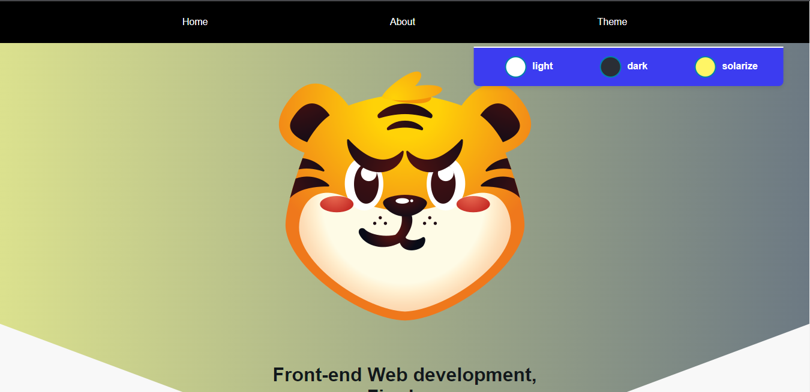

# Theme Changer Markup

A simple theme changing markup to switch between light mode and dark mode.

* Pure Css for DOM events
* Can remember Theme settings (JS required)

>Screenshots

### Light mode

### Dark mode
